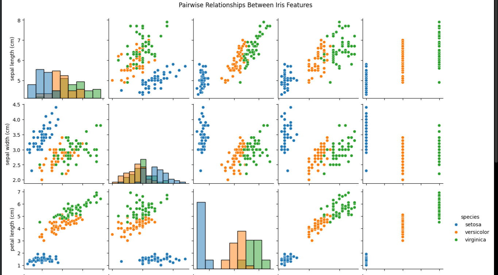
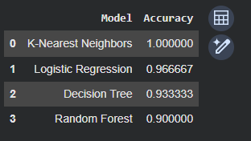

# 🌸 Iris Flower Classification

## Oasis Infobyte — Data Science Internship


---

## 📌 Problem Statement

Develop a machine learning classification system that predicts the species of an Iris flower based on its sepal and petal measurements.

---

## 🎯 Objective

The objectives of this project are:

* To explore the Iris dataset through Exploratory Data Analysis (EDA)
* To understand relationships between the flower features
* To perform feature selection analysis
* To train multiple classification models
* To evaluate and compare model performance
* To select the best-performing classification model
* To predict the species of a new Iris flower

---

## 🛠️ Technologies Used

* Python
* Pandas
* NumPy
* Matplotlib
* Seaborn
* Scikit-learn
* Google Colab / Jupyter Notebook

---

## 📊 Dataset

The project uses the **Iris dataset** available through Scikit-learn.

The dataset contains:

* **150 samples**
* **4 features**
* **3 target classes**

### Features

* Sepal Length
* Sepal Width
* Petal Length
* Petal Width

### Classes

* Setosa
* Versicolor
* Virginica

---

## ⚙️ How to Install / Run

### Google Colab

1. Open the `Iris_Flower_Classification_OIBSIP.ipynb` file in Google Colab.
2. Run the notebook cells sequentially.
3. Review the EDA visualizations and model evaluation results.
4. Execute the new flower prediction section to test a sample input.

### Required Libraries

```bash
pip install pandas numpy matplotlib seaborn scikit-learn
```

---

## 🔄 How the Project Works

The project follows an end-to-end machine learning workflow:

1. Load the Iris dataset using Scikit-learn.
2. Convert the dataset into a Pandas DataFrame.
3. Inspect the dataset structure and statistical information.
4. Check for missing values and duplicate records.
5. Perform Exploratory Data Analysis.
6. Visualize species distribution.
7. Analyze feature relationships using pair plots.
8. Analyze feature distributions using box plots.
9. Examine feature correlations using a heatmap.
10. Perform feature selection analysis.
11. Split the dataset into training and testing sets using an 80/20 split.
12. Train multiple classification models.
13. Evaluate the models using accuracy, classification reports, and confusion matrices.
14. Compare model performance.
15. Use 5-fold cross-validation to examine model consistency.
16. Analyze Random Forest feature importance.
17. Use the selected model to predict the species of a new flower.
18. Display prediction probabilities for the three Iris species.

---

## 🤖 Machine Learning Models

The following classification algorithms are implemented:

* Logistic Regression
* K-Nearest Neighbors
* Decision Tree
* Random Forest

---

## 📈 Results / Output

The models are compared using:

* Accuracy
* Precision
* Recall
* F1-score
* Confusion Matrix
* 5-Fold Cross-Validation

The notebook displays the model comparison results and identifies the best-performing model based on the evaluation results.

The project also provides:

* Species distribution visualization
* Pair plot
* Box plots
* Correlation heatmap
* Model accuracy comparison
* Confusion matrices
* Cross-validation comparison
* Random Forest feature importance
* New flower species prediction
* Prediction probability visualization

> **Note:** The exact model accuracy values and prediction results are available in the executed Jupyter Notebook.

---

## 📸 Screenshots

### Pairwise Feature Relationships



### Model Accuracy Results



### Model Accuracy Comparison

.png)

### Logistic Regression — Confusion Matrix


### K-Nearest Neighbors — Confusion Matrix


### Decision Tree — Confusion Matrix


### Random Forest — Confusion Matrix


### New Flower Prediction


### Prediction Probability


### Prediction Probability Graph


---

## 🎥 Demo Link

**LinkedIn Demo Video:**
*To be added after publishing the project demonstration.*

**GitHub Repository:**
This project is included in the `OIBSIP` repository.

---

## ✅ Conclusion

The Iris Flower Classification project demonstrates a complete machine learning classification workflow, including data exploration, visualization, model training, evaluation, comparison, and prediction.

Multiple classification algorithms were evaluated to determine a suitable model for predicting Iris flower species from their sepal and petal measurements.


